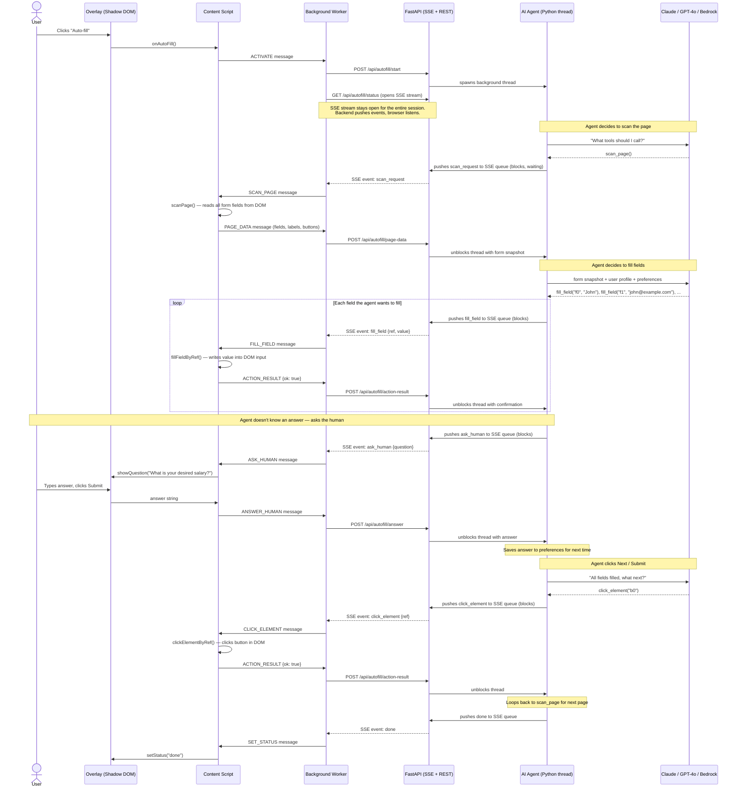

<p align="center">
  
</p>

<h1 align="center">Clerk-Bot</h1>

<p align="center">
  <strong>AI-Powered Universal Form Auto-Filler</strong><br>
  Chrome extension + local Python backend that parses your documents and auto-fills any form on any website.
</p>

<p align="center">
  
  
  
  
</p>

---

## How It Works

You navigate to a form, click "Auto-fill", and the AI fills everything.

1. The **content script** scans the page and sends a snapshot of all form fields to the backend
2. The **AI agent** loads your profile (parsed from your documents) and learned preferences
3. It fills fields it knows — name, email, education, work history, etc.
4. For anything it doesn't know, it asks you via the browser overlay
5. Your answers are saved so it doesn't ask again next time
6. It clicks Next/Submit and repeats for multi-page forms

All data stays local on your machine (`~/.clerk-bot/`). The only external call is to your chosen AI provider.

---

## Architecture



---

## Quick Start

### Prerequisites

- Python 3.10+
- Node.js 18+ (for building the extension)
- An API key from [Anthropic](https://console.anthropic.com/), [OpenAI](https://platform.openai.com/), or AWS Bedrock

### 1. Set Up the Backend

```bash
cd backend
pip install -e .

# First-time setup — creates ~/.clerk-bot/ and configures your API key
clerk-bot init
```

### 2. Add Your Documents

```bash
# Drop your resume, passport, license, insurance card, etc.
cp ~/resume.pdf ~/.clerk-bot/documents/
cp ~/passport.jpg ~/.clerk-bot/documents/
```

Supported formats: PDF, PNG, JPG, TXT, Markdown

### 3. Start the Server

```bash
clerk-bot start
# → Server runs at http://localhost:8394
```

### 4. Build & Install the Chrome Extension

```bash
cd extension
npm install
npx wxt build
```

Load in Chrome:
1. Go to `chrome://extensions`
2. Enable **Developer mode** (top-right toggle)
3. Click **Load unpacked**
4. Select the `extension/.output/chrome-mv3` folder

### 5. Fill a Form

1. Navigate to any website with a form
2. Click the Clerk-Bot extension icon
3. Click **Auto-fill**
4. Watch the overlay — answer any questions the agent asks
5. Done! Your answers are saved for next time.

---

## Configuration

All config lives in `~/.clerk-bot/.env`:

```env
# Model provider: anthropic (default) | openai | bedrock
CLERK_MODEL_PROVIDER=anthropic

# Model ID (optional — defaults to claude-haiku-4-5)
CLERK_ANTHROPIC_MODEL=claude-haiku-4-5

# API keys (set the one matching your provider)
ANTHROPIC_API_KEY=sk-ant-...
OPENAI_API_KEY=sk-...
AWS_PROFILE=default

# Server port (optional)
CLERK_PORT=8394
```

---

## CLI Commands

```bash
clerk-bot init     # First-time setup wizard
clerk-bot start    # Start the backend server
clerk-bot status   # Check server health, documents, profile
```

---

## Development

### Backend

```bash
cd backend
pip install -e .
clerk-bot start    # runs with auto-reload via uvicorn
```

### Extension

```bash
cd extension
npm install
npx wxt dev        # hot-reload development mode
```

Load the dev build from `extension/.output/chrome-mv3-dev`.

---

## Disclaimer

Clerk-Bot uses AI to fill forms. AI can make mistakes, it may fill fields incorrectly, misinterpret labels, or enter wrong values. Always review what the agent has filled before submitting any form. You are responsible for verifying the accuracy of all submitted data. This tool is provided as-is with no warranty.
